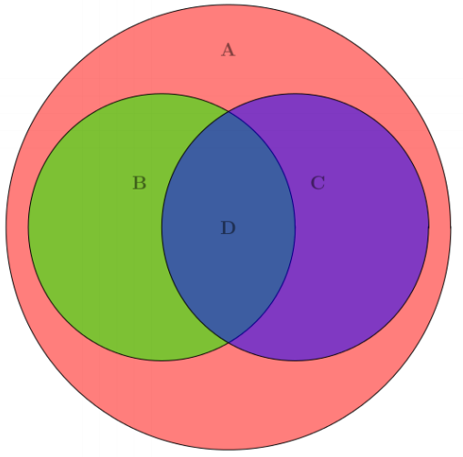
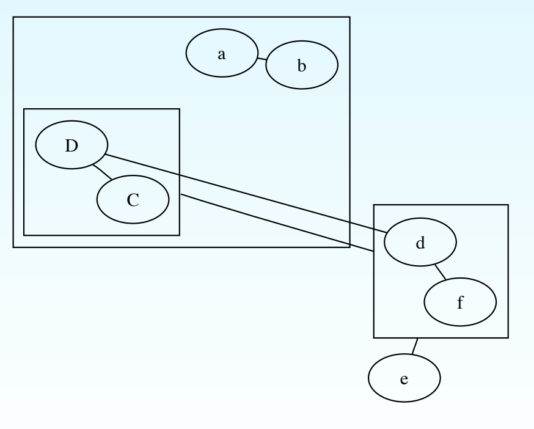

## Is Visualization Good Enough?

Let's say you are writing a paper. It has a function that you are including as LaTex,
and it renders to this (the graphic is from the 
<a href="http://penrose.ink/Penrose_DSLDI_slides.pdf" target="_blank">original slides</a> 
by one of the authors):


Now let's say you are feeling adventurous, and want to help your readers by including
a diagram. This should be fairly simple, right? Here is how it looks to generate
with <a href="http://www.texample.net/tikz/" target="_blank">tikz</a>:

```
\documentclass{article}
\usepackage{tikz}
\begin{document}
\pagestyle{empty}
\begin{tikzpicture}
 \begin{scope}[shift={(3cm,-5cm)}, fill opacity=0.5]
 \draw[fill=red, draw = black] (0,0) circle (5);
 \draw[fill=green, draw = black] (-1.5,0) circle (3);
 \draw[fill=blue, draw = black] (1.5,0) circle (3);
 \node at (0,4) (A) {\large\textbf{A}};
 \node at (-2,1) (B) {\large\textbf{B}};
 \node at (2,1) (C) {\large\textbf{C}};
 \node at (0,0) (D) {\large\textbf{D}};
 \end{scope}
\end{tikzpicture}
\end{document}
```

It makes a pretty picture...



But look at the code above! Yuck. We aren't actually understanding any of the notation,
we are just brute force drawing circles and adjusting the position and coloring.
If you did this for a paper, after figuring out all of the above you'd be
exhausted. The problem is that <b>our visualization software doesn't understand the math</b>.

Let's show another example from the slides, this one with <a href="http://www.graphviz.org/" target="_blank">GraphViz</a>.
Here is the code:

```
graph G {
 e
     subgraph clusterA {
         a -- b;
     subgraph clusterC {
         C -- D;
     }
 }
     subgraph clusterB {
         d -- f
     }
 d -- D
 e -- clusterB
 clusterC -- clusterB
}
```

and resulting visualization:



We again encounter complicated syntax that doesn't do well to describe, for both
human and machine, the expressions. 

> Why are there not more languages like Penrose?

Despite the fact that we learn enormously from visualization, because it isn't an
essential requirement in training or education, it comes as an afterthought. It's
also very hard to do, so it tends to be the case that visualization technology
lags behind methods to understand or produce knowledge.

## Penrose

### What is Penrose?

Now imagine that we had a language for these designs. Penrose is that language.
We would want to be able to say "This is set A, and this is set B, and here is the Intersect between sets A and B."
We would want this represented not only in the visual output, but also the 
code that we type to produce it. Penrose can help us do that. To do this, we define
two "[Domain Specific Languages](https://en.wikipedia.org/wiki/Domain-specific_language)," or DSLs.

#### Substance

What does the word "Substance" make you think of? It refers to some set of core
elements. The substance of a car might be frame and wheels. We don't care that much about
the color, seat material, or other aesthetics. For Penrose, this
means objects in math.

> The Substance Domain Specific Language includes high level declarations of mathematical objects.

#### Style

But we *do* care about the color of the car, and whether it has cloth or leather seats! This is
where the Style domain comes in.

> The Style Domain Specific Language includes the visual presentation of the objects.


### What different kinds of users are there?

 1. **Developers** want to create new visualizations for specific kinds of math or equations.
 2. **Users** might just be interested in plugging their LaTex into a style to get a pretty rendering for teaching materials or manuscripts.


## An Example

To go back to the simple sentence _This is set A, and this is set B, and here is the Intersect between sets A and B._
let's now look at how we might define this using Penrose Substance and Style languages. We won't
go into the details of this example, but will give you enough to show how intuitive it is to
use Penrose.  Take a look at this file and see if you can figure out what it's saying.

```
Set A, B
Intersect A B

Set A {
 shape = Circle{ }
}
Intersect X Y {
 ensure X overlapping Y
}
```

The first two lines are considered `Substance` because we are defining objects.
The next part, which you can read as "set A is a circle" and "For an intersect between
some X and Y we must ensure that X is overlapping Y."
