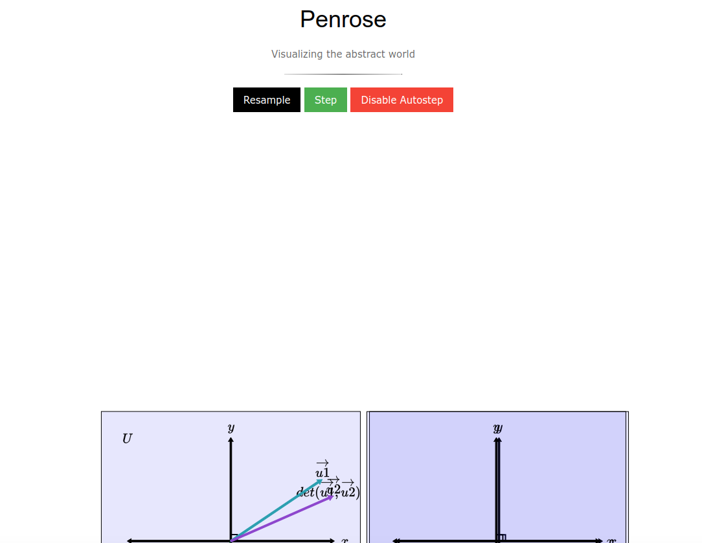

## Getting started

### Docker

We have a container provided on [Docker Hub](https://hub.docker.com/r/vanessa/penrose) for you to use! 
We assume you have [Docker installed](https://www.docker.com/products/docker-desktop).


#### Penrose Binary
Let's run the container without any special binds or commands, and this will hit the Penrose
binary:


```bash
$ docker run -it vanessa/penrose
Usage: ./Main prog1.sub prog2.sty prog3.dsl
```

What else can we do? Let's ask for help.

```bash
$ docker run -it vanessa/penrose --help
Usage:

         docker run <container> [help|web]
         docker run -p 8000:8000 -p 9060:9060 <container> web

         Options:
            --port -p :    change the penrose port (default 8000)
            --template -t: choose a penrose template to run (blank to see options)
            --custom:  -c: provide your own determinants.sub, *.sty, and *.dsl
                           as input to the penrose executable

         Commands:

                help: show help and exit
                web: start penrose frontend (requires mapping of ports)         

         Examples:
             docker run -p 8000:8000 -p 9060:9060 <container> web --custom math.sub math.sty math.det
             docker run -p 8000:8000 -p 9060:9060 <container> web linear-algebra
```


Cool! Let's try mapping a port with web, and see what happens...

```bash
$ docker run -it -p 8000:8000 -p 9160:9160 vanessa/penrose web
Please specify a template to run! Choices are:

linear-algebra
real-analysis
```

Oh right, I need to specify a domain template!

```bash
$ docker run -it -p 8000:8000 -p 9160:9160 vanessa/penrose web --template linear-algebra

...
   Style program warnings   
Warning: Sub obj 'T1''s field 'sameHeight' is overridden, but was not declared an override
Warning: Sub obj 'T1''s field 'nonIntersect' is overridden, but was not declared an override
Warning: Sub obj 'T''s field 'sameHeight' is overridden, but was not declared an override
Warning: Sub obj 'T''s field 'nonIntersect' is overridden, but was not declared an override
Warning: Sub obj 'U''s field 'sameHeight' is overridden, but was not declared an override
Warning: Sub obj 'U''s field 'nonIntersect' is overridden, but was not declared an override

Visualizing Substance program:

Starting Server...
```

This will spit out a *ton* of verbosity on your command line. Importantly, if you open
your browser to [http://localhost:8000/client.html](http://localhost:8000/client.html)
you will see the viewer. If you click "Autostep" things move around.



Right now, since the plugins are included with the base software, we don't have an 
elegant way to specify custom *.sub files other than to provide paths to all three
(either in the container, or a directory that is mounted.) For example:

```bash
# What *.sub files do I have under real-analysis?
$ docker run -it --entrypoint ls vanessa/penrose /penrose/src/domains/linear-algebra
determinants.sub    norm.sub		   twoVectors.sub
linear-algebra.dsl  paperSpec.sub	   vectorsAddition-3.sub
linear-algebra.sty  scale.sub		   vectorsAddition.sub
linearMap.sub	    threeVectorSpaces.sub  vectorsAddition2.sub
linearMap_add.sub   twoVectorSpaces-2.sub  vectorsNegation.sub
norm-2.sub	    twoVectorSpaces.sub
```

Let's choose a triad to run:

twoVectors.sub linear-algebra-domain/linear-algebra.sty linear-algebra-domain/linear-algebra.dsl

```bash
PENROSE_STY=/penrose/src/domains/linear-algebra/linear-algebra.sty
PENROSE_SUB=/penrose/src/domains/linear-algebra/twoVectors.sub
PENROSE_DSL=/penrose/src/domains/linear-algebra/linear-algebra.dsl

docker run -it -p 8000:8000 -p 9160:9160 vanessa/penrose web --custom "${PENROSE_SUB}" "${PENROSE_STY}" "${PENROSE_DSL}"
```

Note that I'm no

 
Note that @vsoch is currently still struggling to get websockets working. More to come.
